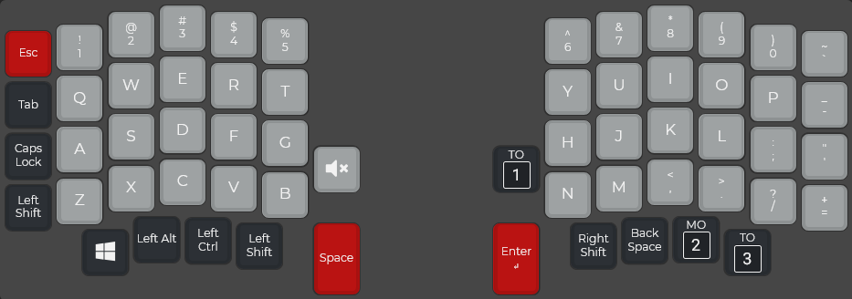
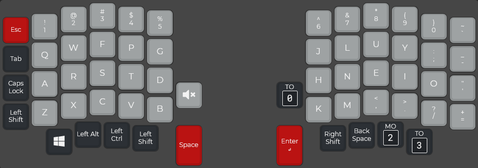
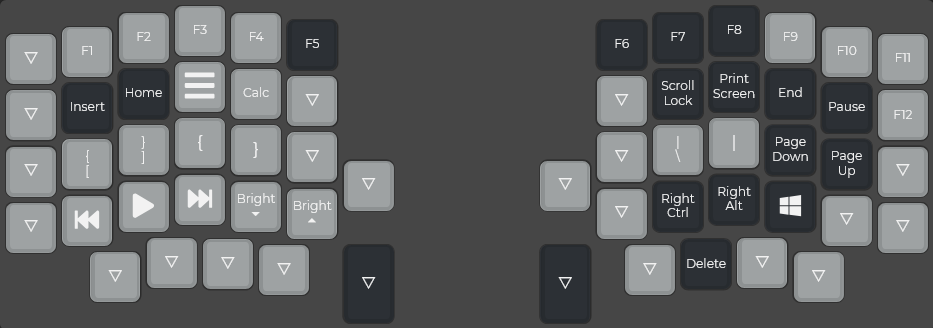
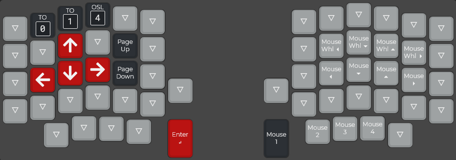
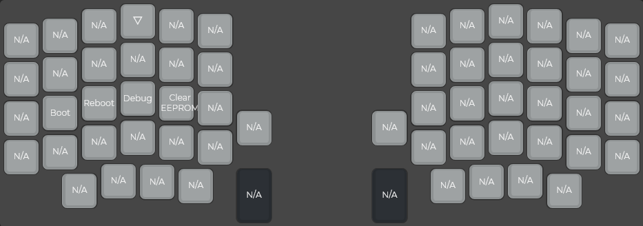
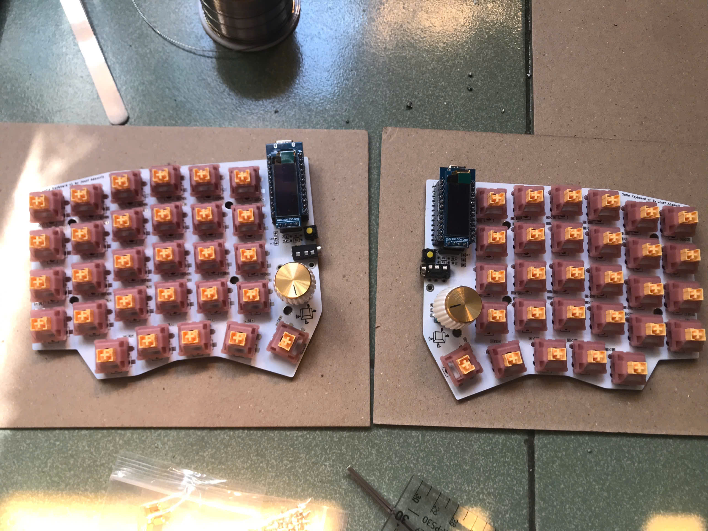
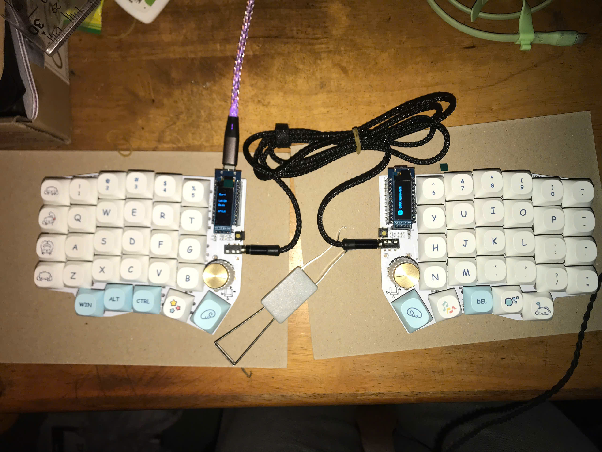

# QMK Sofle layout

This is my repository dedicated to documenting and maintaining the firmware for the keyboard i'm currently using, the Sofle ortholinear split keyboard.

## Hardware
### PCB

The one I am currently using is specifically the initial version of the Sofle, the Sofle v1. It is 6×4+5 keys column-staggered split keyboard with encoder support created by [Josef Adamcik](https://josef-adamcik.cz/). For more information and documentation, see [https://josefadamcik.github.io/SofleKeyboard/](https://josefadamcik.github.io/SofleKeyboard/)

### Switches
Otemu Peach V3 silent switches 
### MCUs
2 ProMicro's with ATMEGA32U4 and 2 ,91 inch screens

## Firmware 

Sofle uses [QMK firmware](https://qmk.fm/)

## Layout 

## Images of keyboard
### Switches
Otemu Peach V3 silent switches

### Keycaps
"Rabbit Cute" MA profile, PBT plastic
